<picture>
  <source media="(prefers-color-scheme: dark) and (max-width: 640px)" srcset="./assets/hero-dark-mobile.svg">
  <source media="(prefers-color-scheme: light) and (max-width: 640px)" srcset="./assets/hero-light-mobile.svg">
  <source media="(prefers-color-scheme: dark)" srcset="./assets/hero-dark.svg">
  <source media="(prefers-color-scheme: light)" srcset="./assets/hero-light.svg">
  
</picture>

# Felmon Fekadu

**I build software that leaves evidence.**

Developer tools and AI reliability systems that expose hidden behavior, enforce deterministic gates, and make regressions impossible to ignore.

[Portfolio](https://felmon.tech) · [Technical writing](https://felmon.tech/writing) · [Email](mailto:felmonon@gmail.com) · [LinkedIn](https://www.linkedin.com/in/felmonfekadu/)

## `01 / CLAIM`

Most software says **“it worked.”**

I care about the harder questions: **What happened? What changed? What can we prove?**

I build the layer that answers those questions.

## `02 / INSTRUMENTS`

| Failure mode | Instrument | Evidence emitted |
| --- | --- | --- |
| Mock drift | [`msw-inspector`](https://github.com/felmonon/msw-inspector) | Coverage report + CI gate |
| Agent trajectory regression | [`agent-reliability-harness`](https://github.com/felmonon/agent-reliability-harness) | Policy findings + baseline diff |
| Retrieval without evidence | [`docagent-studio`](https://github.com/felmonon/docagent-studio) | Citations + offline evaluation |
| Opaque coding-agent quality | [`agent-fight-club`](https://github.com/felmonon/agent-fight-club) | Scored, replayable bouts |
| Unproven product assumptions | [TypeJung](https://typejung.com) · [source](https://github.com/felmonon/jungian-typology-assessment) | A live, paid user journey |

## `03 / ONE RECORDED TRACE`

<picture>
  <source media="(prefers-color-scheme: dark) and (max-width: 640px)" srcset="./assets/trace-dark-mobile.svg">
  <source media="(prefers-color-scheme: light) and (max-width: 640px)" srcset="./assets/trace-light-mobile.svg">
  <source media="(prefers-color-scheme: dark)" srcset="./assets/trace-dark.svg">
  <source media="(prefers-color-scheme: light)" srcset="./assets/trace-light.svg">
  
</picture>

> A demo shows that something worked once. A trace helps explain why it will keep working.

## `04 / OPERATING CONSTRAINTS`

```text
01  Evidence over adjectives.
02  Deterministic checks in CI. Model judgment offline.
03  Narrow interfaces. Reproducible failures. Useful artifacts.
```

## `05 / PROOF LEDGER`

| Record | Public evidence |
| --- | --- |
| `PACKAGE / NPM` | [`msw-inspector-cli` v0.3.2](https://www.npmjs.com/package/msw-inspector-cli) + [GitHub Marketplace Action](https://github.com/marketplace/actions/msw-inspector) |
| `PACKAGE / PYPI` | [`agent-reliability-harness` v0.2.2](https://pypi.org/project/agent-reliability-harness/) |
| `UPSTREAM` | [14 merged pull requests across 7 repositories / 5 organizations](https://github.com/search?q=author%3Afelmonon+is%3Apr+is%3Amerged+-user%3Afelmonon&type=pullrequests) |
| `COMMUNITY` | [5 outside human contributors in `msw-inspector`](https://github.com/felmonon/msw-inspector/graphs/contributors) |
| `PRODUCT` | [TypeJung](https://typejung.com), a live full-stack paid product |
| `WRITING` | [Deterministic checks beat model-judged evals in CI](https://felmon.tech/writing/deterministic-checks-for-agent-evals) |

<sub>[Dated public proof snapshot](./data/proof-snapshot.json), verified 2026-08-01. Every count also links to its live public record.</sub>

## `06 / HANDOFF`

> **Have a failure mode you cannot see yet? Send me the trace.**

[felmon.tech](https://felmon.tech) · [felmonon@gmail.com](mailto:felmonon@gmail.com) · [all repositories](https://github.com/felmonon?tab=repositories)

<sub>CALGARY / CANADA · TYPESCRIPT / PYTHON · [PROFILE DATA](./data/profile.json) · NOT A RÉSUMÉ. A TRACE.</sub>
